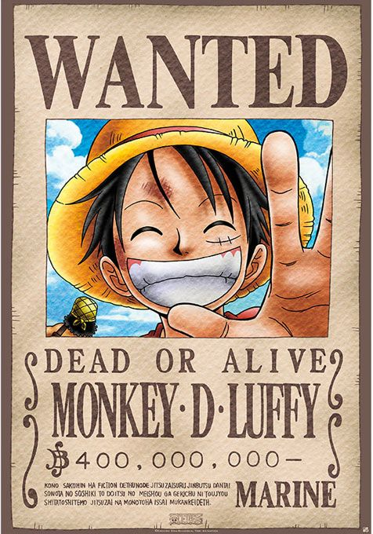

---
tags:
- OnePice
- WantedPoster
- AnimeStyle
- ImagePrompt
---
# Petición General Para Crear Prompt De Cartel Wanted De One Piece

**Descripción:** Genera un prompt altamente optimizado para que cualquier IA de imagen cree un cartel de recompensa al estilo One Piece personalizado con la imagen de un usuario.

**Modelo Recomendado:** GPT-4o, Gemini, Kimi o cualquier LLM avanzado.

**Tags:** `#OnePiece` `#WantedPoster` `#AnimeStyle` `#ImagePrompt`

---

## 📋 Variables a preparar
Antes de usar este prompt, asegúrate de tener clara esta información para reemplazarla en el texto:
- `[NOMBRE]`: Nombre de la persona que aparecerá en el cartel.
- `[RECOMPENSA]`: El monto de la recompensa (ej: "$500,000,000-"). Si no se especifica, se usará el valor por defecto.

---

## 🚀 Prompt
*Usa el botón de copiar de GitHub en la esquina superior derecha del bloque.*

```text
Actúa como un Experto en Ingeniería de Prompts para Generación de Imágenes por IA.
Tu objetivo es crear un prompt altamente detallado y optimizado para una IA generadora de imágenes (como Midjourney, DALL-E 3, Stable Diffusion, etc.) que recree el famoso cartel de "WANTED" de One Piece utilizando una imagen proporcionada por el usuario.

Sigue estos lineamientos para construir el prompt final:

1. Estilo Visual: El sujeto de la foto debe ser adaptado al estilo artístico de "One Piece" (Eiichiro Oda), manteniendo sus rasgos significativos y su posición exacta.
2. Composición: El contexto debe estar medianamente dibujado, sin fondo distractor, destacando al sujeto o sujetos (incluyendo animales si aparecen).
3. Textos Exactos del Cartel:
   - "WANTED" (en la parte superior).
   - "DEAD OR ALIVE" (debajo de WANTED).
   - "FOTO DE USUARIO" (debajo del primer DEAD OR ALIVE).
   - "DEAD OR ALIVE" (debajo de FOTO).
   - "[NOMBRE]" (el nombre del pirata).
   - "[RECOMPENSA]" (por defecto "$500,000,000-" si no se define otra).
   - El texto pequeño legal en la base: "Kono Sakuhin ha/wa fiction dethunode jitsuzaisuru jinbutsu dantaisonota no soshiki to doitsu no meishou ga gekichu ni toujyou shitatoshitemo Jitsuzai na monotoha issai mukankeideth".

Parámetros actuales:
- Nombre: [NOMBRE]
- Recompensa: [RECOMPENSA]

Por favor, genera un prompt robusto en inglés (que es el lenguaje que mejor entienden las IAs de imagen) que describa detalladamente la textura del papel envejecido, la tipografía rústica, el sombreado estilo manga y la integración natural del sujeto en el cartel.
```

Aquí tienes el contexto:
`[NOMBRE]` y `[RECOMPENSA]`

```adjunto
Por favor, asegúrate de cumplir con los siguientes requisitos:
1. El prompt final generado debe estar optimizado para el modelo que el usuario elija (Midjourney, DALL-E, etc.).
2. Debe enfatizar la fidelidad de los rasgos de la persona en el estilo anime.
3. Debe incluir los elementos icónicos del cartel como el color sepia, el desgaste del papel y la tipografía característica.
4. Fondo de color negro.
```

El formato de salida debe ser:
Un bloque de código con el prompt optimizado en inglés, seguido de una breve explicación de los parámetros clave utilizados.

Imagen de referencia para que la IA pueda tomar mayor fideldiad de la referencia:

